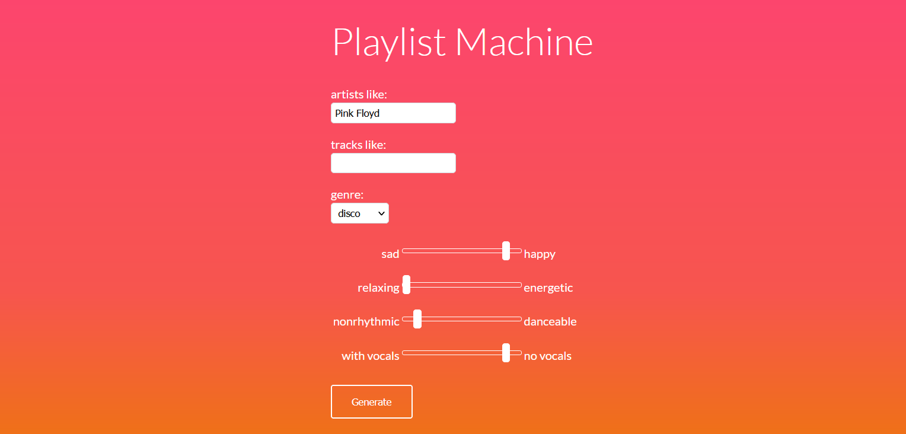
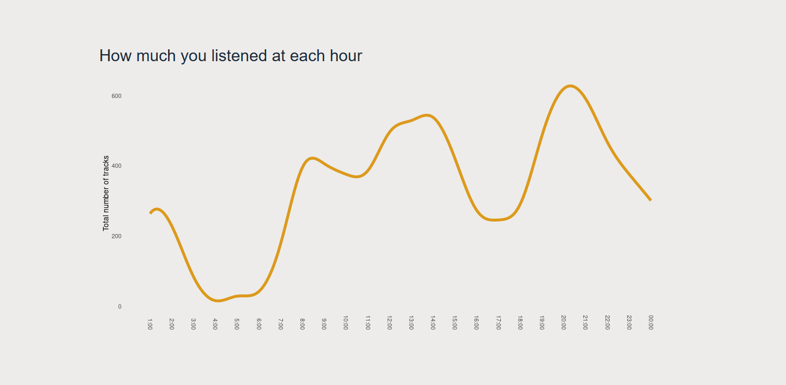

[🇬🇧](https://eluczak.github.io) [🇩🇪](https://eluczak.github.io/de)

## Projekte

**Playlist Machine**\
Eine Web-App, die Wiedergabelisten auf der Grundlage des ausgewählten Künstlers, Titels und Genres erstellt. Man kann auch die Audioeigenschaften einrichten. Mit dieser App kannst du eine Musik finden, die dem Künstler, den du magst, ähnlich ist, aber z. B. rhythmischer oder peppiger ist.\
Tools: Python (Flask), Spotify Web API.

* [Github](http://github.com/eluczak/playlist-machine) 

**Explorify**\
Eine Dashboard-Webapplikation, die deinen Hörverlauf in Spotify visualisiert. Keine Anmeldung bei Spotify notwendig. \
Hauptfunktionen: Top-Künstler, Top-Titel, stündliche und monatliche Diagramme.\
Tools: R, Shiny.

* [Projektseite](https://eluczak.github.io/explorify/)
* [Live-App](https://eluczak.shinyapps.io/explorify/)

Neben meinen eigenen Projekten helfe ich gerne anderen bei [Stack Overflow](https://stackoverflow.com/users/9472575). Manchmal bin ich zwar der Fragesteller :) aber das Antworten macht mir mehr Spaß.

## Fähigkeiten

Datenmanipulation, Datenvisualisierung

**Tools:**  MS Excel, Qlik, SQL, Python, R, reguläre Ausdrücke\
**Sprachen:** Polnisch (Muttersprache), Englisch (B2), Deutsch (B1)\
**Sonstiges:** Liebe zum Detail, didaktische Kompetenzen 

## Kontakt

[Linkedin](https://www.linkedin.com/in/ewelina-luczak)

ewelina.luczak\
(at) gmail (dot) com

